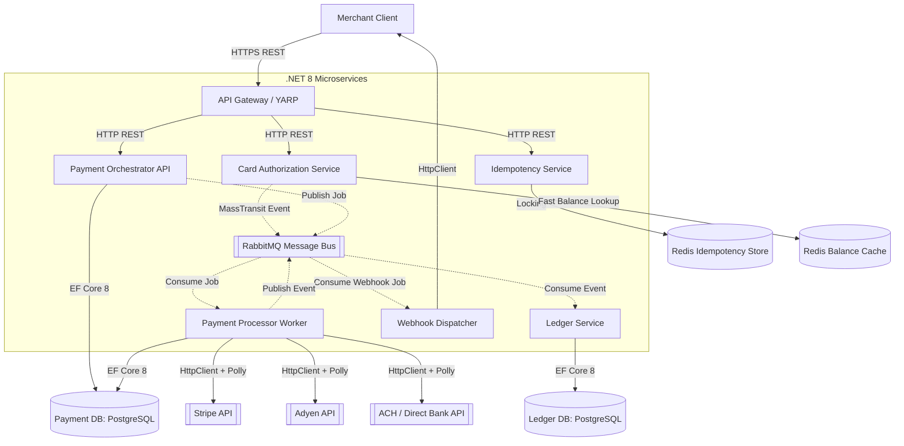
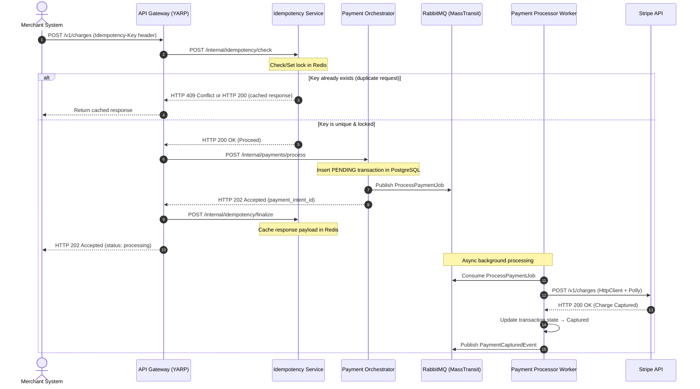
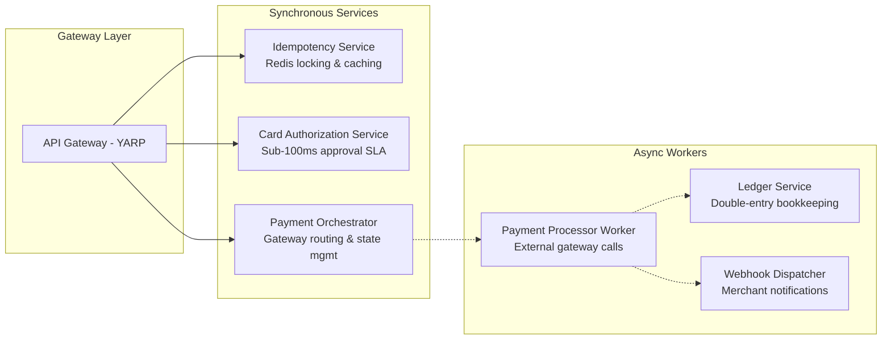
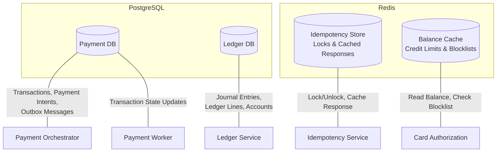
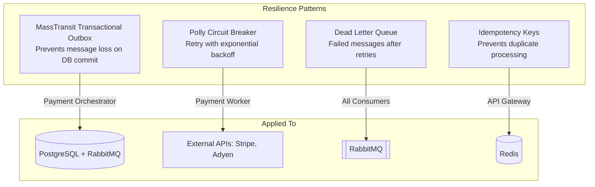

# System Design: Payment Processing Platform

## Architecture Overview

This document describes the system design for a resilient, high-performance payment processing and card authorization platform built with .NET 8, REST APIs, RabbitMQ (MassTransit), PostgreSQL, and Redis.

---

## High-Level Architecture Diagram

---

## Request Flow: Charge Payment (Sequence Diagram)

---

## Service Responsibilities

---

## Data Storage Layout

---

## Fault Tolerance Strategy

---

## Technology Stack

| Layer | Technology | Purpose |
|-------|-----------|---------|
| API Gateway | YARP (.NET) | Reverse proxy, auth, load balancing |
| REST APIs | ASP.NET Core Minimal APIs | Low-latency HTTP endpoints |
| Messaging | RabbitMQ + MassTransit | Async event-driven communication |
| Relational DB | PostgreSQL | Transactions, ledger entries |
| Cache/Locks | Redis (StackExchange.Redis) | Idempotency, balance caching |
| ORM | EF Core 8 + Dapper | Writes (EF Core) / Reads (Dapper) |
| Resilience | Polly | Retry, circuit breaker, timeout |
| Containerization | Docker + Kubernetes (AKS) | Deployment & orchestration |
